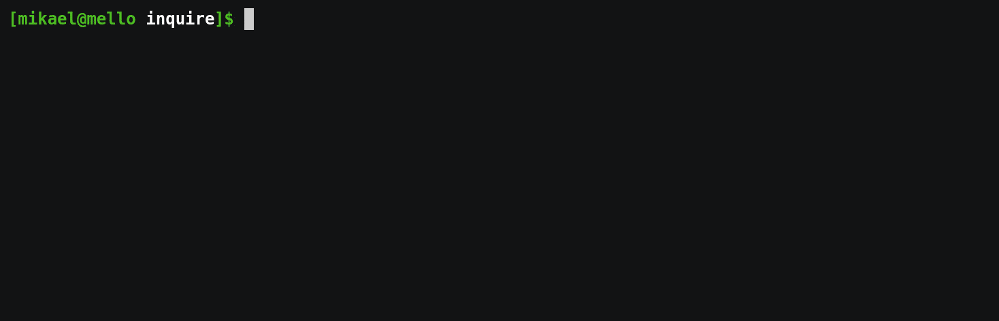

# inquire

[![Latest Version]][crates.io] ![License]

`inquire` is a library for building interactive prompts on terminals, inspired by [survey](https://github.com/AlecAivazis/survey).

## Demo


[Source](examples/form.rs)

## Examples

Examples can be found in the `examples` directory. Run them to see basic behavior:

```
$ cargo run --example form
```

[crates.io]: https://crates.io/crates/inquire
[Latest Version]: https://img.shields.io/crates/v/inquire.svg
[License]: https://img.shields.io/crates/l/inquire.svg