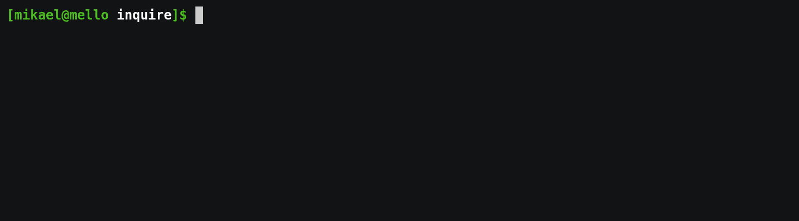
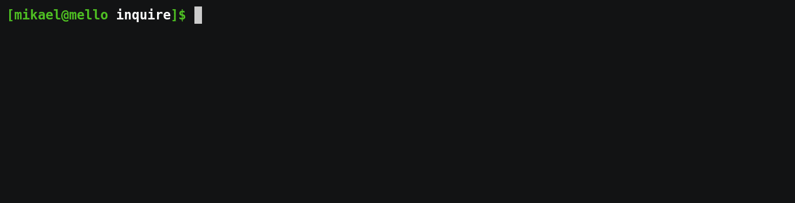
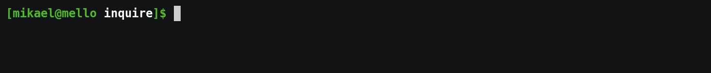
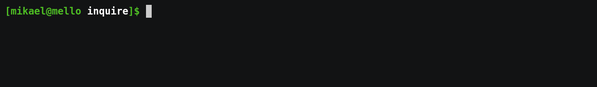

[![Latest Version]][crates.io] [![Docs]][docs.rs] ![Build status] ![Unsafe forbidden] ![Supported platforms] ![License]

[crates.io]: https://crates.io/crates/inquire
[latest version]: https://img.shields.io/crates/v/inquire.svg
[docs]: https://img.shields.io/docsrs/inquire/latest?logo=docs.rs
[docs.rs]: https://docs.rs/inquire
[build status]: https://github.com/mikaelmello/inquire/actions/workflows/build.yml/badge.svg
[unsafe forbidden]: https://img.shields.io/badge/unsafe-forbidden-success.svg
[supported platforms]: https://img.shields.io/badge/platform-linux%20%7C%20macos%20%7C%20windows-success
[license]: https://img.shields.io/crates/l/inquire.svg

---

<p align="center">
  
  <br>
  <code>inquire</code> is a library for building interactive prompts on terminals.
</p>

It provides several different prompts in order to interactively ask the user for information via the CLI. With `inquire`, you can use:

- [`Text`] to get text input from the user, with _built-in autocompletion support_;
- [`Editor`]\* to get longer text inputs by opening a text editor for the user;
- [`DateSelect`]\* to get a date input from the user, selected via an _interactive calendar_;
- [`Select`] to ask the user to select one option from a given list;
- [`MultiSelect`] to ask the user to select an arbitrary number of options from a given list;
- [`Confirm`] for simple yes/no confirmation prompts;
- [`CustomType`] for text prompts that you would like to parse to a custom type, such as numbers or UUIDs;
- [`Password`] for secretive text prompts.

---

## Demo


[Source](./inquire/examples/expense_tracker.rs)

## Features

- Cross-platform, supporting UNIX and Windows terminals (thanks to [crossterm](https://crates.io/crates/crossterm));
- Several kinds of prompts to suit your needs;
- Standardized error handling (thanks to [thiserror](https://crates.io/crates/thiserror));
- You can choose your terminal backend between `crossterm` (default), `termion` or `console`.
  - Perfect if you already use one library and do not want additional dependencies.
- Support for fine-grained configuration for each prompt type, allowing you to customize:
  - Rendering configuration (aka color theme + other components);
  - Default values;
  - Placeholders;
  - Input validators and formatters;
  - Help messages;
  - Autocompletion for [`Text`] prompts;
  - Confirmation messages for [`Password`] prompts;
  - Custom list filters for [`Select`] and [`MultiSelect`] prompts;
  - Custom parsers for [`Confirm`] and [`CustomType`] prompts;
  - Custom extensions for files created by [`Editor`] prompts;
  - and many others!

## Examples

Examples can be found in the `examples` directory. Run them to see basic behavior:

```
cargo run --example expense_tracker --features date
```

## Usage

Put this line in your `Cargo.toml`, under `[dependencies]`.

```
inquire = "0.7.5"
```

\* This prompt type is gated under a feature flag, e.g.:

```
inquire = { version = "0.7.5", features = ["date"] }
```

# Cross-cutting concerns

There are several features that are shared among different types of prompts. This section will give an overview on each of them.

## Rendering configuration (aka color themes)

All prompts allow you to set a custom `RenderConfig`, a struct that contains lots of style customization options.

With `RenderConfig`, you can customize foreground color, background color and attributes (e.g. bold) of most components that are part of a prompt. Additionally, you can also customize the content of special tokens, such as prompt prefixes, highlighted-option prefixes, selected and unselected checkboxes, etc. If you do not want to re-set the render config object for each new prompt you create, you can call `inquire::set_global_render_config` to set a global RenderConfig object to be used as the default one for all future prompts.

This allows you to have greater control over the style of your application while continuing to have a clean API to create prompts as smoothly as possible.

In the [`render_config.rs`](./inquire/examples/render_config.rs) example, you can take a look at the capabilities of this API. The example is exactly the same one as [`expense_tracker.rs`](./inquire/examples/expense_tracker.rs), but with several style aspects customized. Take a look at their differences:


[Source](./inquire/examples/expense_tracker.rs)

[Source](./inquire/examples/render_config.rs)

## Validation

Almost all prompts provide an API to set custom validators.

The validators provided to a given prompt are called whenever the user submits their input. These validators vary by prompt type, receiving different types of variables as arguments, such as `&str`, `&[ListOption]`, or `NaiveDate`, but their return type are always the same: `Result<Validation, CustomUserError>`.

The `Validation` type is an enum that indicates whether the user input is valid, in which you should return `Ok(Validation::Invalid)`, or invalid, where you should return `Ok(Validation::Invalid(ErrorMessage))`. The `ErrorMessage` type is another enum, containing the `Default` and `Custom(String)` variants, indicating the message to indicate the user that their input is invalid.

With an Invalid result, it is recommended that you set the `ErrorMessage` field to a custom message containing helpful feedback to the user, e.g. "This field should contain at least 5 characters".

The `CustomUserError` type is an alias to `Box<dyn std::error::Error + Send + Sync + 'static>`. Added to support validators with fallible operations, such as HTTP requests or database queries. If the validator returns `Err(CustomUserError)`, the prompt will return `Err(InquireError::Custom(CustomUserError))` as its result, containing the error you returned wrapped around the enums mentioned.

The validators are typed as a reference to `dyn Fn`. This allows both functions and closures to be used as validators, but it also means that the functions can not hold any mutable references.

Finally, `inquire` has a feature called `macros` that is included by default. When the feature is on, several shorthand macros for the builtin validators are exported at the root-level of the library. Check their documentation to see more details, they provide full-featured examples.

In the [demo](#demo) you can see the behavior of an input not passing the requirements in the _amount_ prompt, when the error message "Please type a valid number" is displayed. _Full disclosure, this error message was displayed due to a parsing, not validation, error, but the user experience is the same for both cases._

If you'd like to see more examples, the [`date.rs`](./inquire/examples/date.rs) and [`multiselect.rs`](./inquire/examples/multiselect.rs) files contain custom validators.

## Terminal Back-end

Currently, there are like 3 major libraries to manipulate terminals: [crossterm](https://lib.rs/crates/crossterm), [console](https://lib.rs/crates/console) and [termion](https://lib.rs/crates/termion).

Binary Rust applications that intend to manipulate terminals will probably pick any one of these 3 to power underlying abstractions. `inquire` chose to support crossterm by default in order to support many features on Windows out-of-the-box.

However, if your application already uses a dependency other than crossterm, such as console or termion, you can enable another terminal via feature flags. It is also important to disable inquire's default features as it comes with `crossterm` enabled by default. Such as this:

```toml
inquire = { version = "0.7.5", default-features = false, features = ["termion", "date"] }
```

or this:

```toml
inquire = { version = "0.7.5", default-features = false, features = ["console", "date"] }
```

## Formatting

Formatting is the process of transforming the user input into a readable output displayed after the user submits their response. By default, this is in some cases just echoing back the input itself, such as in Text prompts. Other prompts have different formatting rules by default, for example DateSelect which formats the selected date into something like "August 5, 2021".

All prompts provide an API to set custom formatters. By setting a formatter, you can customize how the user's response is displayed to them. For example, you might want to format a selected date into a new format such as "05/08/2021".

Custom formatters receive the input as an argument, with varying types such as `&str`, `chrono::NaiveDate`, and return a `String` containing the output to be displayed to the user. Check the docs for specific examples.

In the [demo](#demo) you can see this behavior in action with the _amount_ (CustomType) prompt, where a custom formatter adds a '$' character prefix to the input.

## Parsing

Parsing features are related to two prompts: [`Confirm`] and [`CustomType`]. They return to you a value (of types `bool` or any custom type you might want) parsed from the user's text input. In both cases, you can either use default parsers that are already built-in or provide custom ones adhering to the function signatures.

The default `bool` parser returns `true` if the input is either `"y"` or `"yes"`, in a case-insensitive comparison. Similarly, the parser returns `false` if the input is either `"n"` or `"no"`.

The default parser for [`CustomType`] prompts calls the `parse::<T>()` method on the input string. This means that if you want to create a [`CustomType`] with default settings, the wanted return type must implement the `FromStr` trait.

In the [demo](#demo) you can see this behavior in action with the _amount_ (CustomType) prompt.

## Scoring

Scoring is applicable to two prompts: [`Select`] and [`MultiSelect`]. They provide the user the ability to sort and filter the list of options based on their text input. This is specially useful when there are a lot of options for the user to choose from, allowing them to quickly find their expected options.

Scoring functions receive four arguments: the current user input, the option, the option string value and the option index. They must return a `Option<i64>` value indicating whether the option should be part of the results or not.

The default scoring function calculates a match value with the current user input and each option using SkimV2 from [fuzzy_matcher](https://crates.io/crates/fuzzy-matcher), resulting in fuzzy searching and filtering, returning `Some(<score>_i64)` if SkimV2 detects a match.

In the [demo](#demo) you can see this behavior in action with the _account_ (Select) and _tags_ (MultiSelect) prompts.

## Error handling

Error handling when using `inquire` is pretty simple. Instantiating prompt structs is not fallible by design, in order to avoid requiring chaining of `map` and `and_then` methods to subsequent configuration method calls such as `with_help_message()`. All fallible operations are exposable only when you call `prompt()` on the instantiated prompt struct.

`prompt` calls return a `Result` containing either your expected response value or an `Err` of type `InquireError`. An `InquireError` has the following variants:

- **NotTTY**: The input device is not a TTY, which means that enabling raw mode on the terminal in order to listen to input events is not possible. I currently do not know if it is possible to make the library work even if that's the case.
- **InvalidConfiguration(String)**: Some aspects of the prompt configuration were considered to be invalid, with more details given in the value string.
  - This error is only possible in [`Select`], [`MultiSelect`] and [`DateSelect`] prompts, where specific settings might be incompatible. All other prompts always have valid configurations by design.
- **IO(io::Error)**: There was an error when performing IO operations. IO errors are not handled inside `inquire` to keep the library simple.
- **OperationCanceled**: The user canceled the prompt before submitting a response. The user might cancel the operation by pressing `Ctrl-C` or `ESC`.

## Keybindings

To see all of the keybindings registered by prompts, check the [`KEY_BINDINGS.md` file](KEY_BINDINGS.md).

# Prompts

Currently, there are 5 different prompt types supported.

## Text

`Text` is the standard kind of prompt you would expect from a library like this one. It displays a message to the user, prompting them to type something back. The user's input is then stored in a `String` and returned to the prompt caller.

```rust
let name = Text::new("What is your name?").prompt();

match name {
    Ok(name) => println!("Hello {}", name),
    Err(_) => println!("An error happened when asking for your name, try again later."),
}
```


With `Text`, you can customize several aspects:

- **Prompt message**: Main message when prompting the user for input, `"What is your name?"` in the example above.
- **Help message**: Message displayed at the line below the prompt.
- **Default value**: Default value returned when the user submits an empty response.
- **Initial value**: Initial value of the prompt's text input, in case you want to display the prompt with something already filled in.
- **Placeholder**: Short hint that describes the expected value of the input.
- **Validators**: Custom validators to the user's input, displaying an error message if the input does not pass the requirements.
- **Formatter**: Custom formatter in case you need to pre-process the user input before showing it as the final answer.
- **Suggester**: Custom function that returns a list of input suggestions based on the current text input. See more on "Autocomplete" below.

### Autocomplete

With `Text` inputs, it is also possible to set-up an autocompletion system to provide a better UX when necessary.

You can call `with_autocomplete()` and provide a value that implements the `Autocomplete` trait. The `Autocomplete` trait has two provided methods: `get_suggestions` and `get_completion`.

- `get_suggestions` is called whenever the user's text input is modified, e.g. a new letter is typed, returning a `Vec<String>`. The `Vec<String>` is the list of suggestions that the prompt displays to the user according to their text input. The user can then navigate through the list and if they submit while highlighting one of these suggestions, the suggestion is treated as the final answer.
- `get_completion` is called whenever the user presses the autocompletion hotkey (`tab` by default), with the current text input and the text of the currently highlighted suggestion, if any, as parameters. This method should return whether any text replacement (an autocompletion) should be made. If the prompt receives a replacement to be made, it substitutes the current text input for the string received from the `get_completion` call.

For example, in the `complex_autocompletion.rs` example file, the `FilePathCompleter` scans the file system based on the current text input, storing a list of paths that match the current text input.

Every time `get_suggestions` is called, the method returns the list of paths that match the user input. When the user presses the autocompletion hotkey, the `FilePathCompleter` checks whether there is any path selected from the list, if there is, it decides to replace the current text input for it. The interesting piece of functionality is that if there isn't a path selected from the list, the `FilePathCompleter` calculates the longest common prefix amongst all scanned paths and updates the text input to an unambiguous new value. Similar to how terminals work when traversing paths.

### Default behaviors

Default behaviors for each one of `Text` configuration options:

- The input formatter just echoes back the given input.
- No validators are called, accepting any sort of input including empty ones.
- No default values or help messages.
- No autocompletion features set-up.
- Prompt messages are always required when instantiating via `new()`.

## DateSelect



```rust
let date = DateSelect::new("When do you want to travel?")
    .with_default(chrono::NaiveDate::from_ymd(2021, 8, 1))
    .with_min_date(chrono::NaiveDate::from_ymd(2021, 8, 1))
    .with_max_date(chrono::NaiveDate::from_ymd(2021, 12, 31))
    .with_week_start(chrono::Weekday::Mon)
    .with_help_message("Possible flights will be displayed according to the selected date")
    .prompt();

match date {
    Ok(_) => println!("No flights available for this date."),
    Err(_) => println!("There was an error in the system."),
}
```

`DateSelect` prompts allows user to select a date (time not supported) from an interactive calendar. This prompt is only available when including the `date` feature in the dependency, as it brings an additional module (`chrono`) in your dependency tree.

By default, the initial selected date is the current date. The user can navigate through the calendar by pressing the keyboard arrows. If the user also presses the control key along with the arrows, the user will be able to "fast-forward" to previous or next months or years.

More specifically:

- Left arrow moves to the day previous to the one selected, and to the month previous to the one selected when pressed with `ctrl`.
- Analogously, right arrow does the same, but moving to the next day or month.
- Up arrow moves to the day above to the one selected, basically a week before the selected date. When pressed with `ctrl`, it moves to the previous year.
- Analogously, the down arrow moves to a week later or a year later.

Finally, the user selects a date by pressing the space or enter keys.

`DateSelect` prompts provide several options of configuration:

- **Prompt message**: Required when creating the prompt.
- **Default value**: Default value selected when the calendar is displayed and the one select if the user submits without any previous actions. Current date by default.
- **Help message**: Message displayed at the line below the prompt.
- **Formatter**: Custom formatter in case you need to pre-process the user input before showing it as the final answer.
  - Formats to "Month Day, Year" by default.
- **Validators**: Custom validators to the user's selected date, displaying an error message if the date does not pass the requirements.
- **Week start**: Which day of the week should be displayed in the first column of the calendar, Sunday by default.
- **Min and max date**: Inclusive boundaries of allowed dates in the interactive calendar. If any boundary is set, the user will not be able to move past them, consequently not being able to select any dates out of the allowed range.

## Select



```rust
let options: Vec<&str> = vec!["Banana", "Apple", "Strawberry", "Grapes", "Lemon", "Tangerine", "Watermelon", "Orange", "Pear", "Avocado", "Pineapple"];

let ans: Result<&str, InquireError> = Select::new("What's your favorite fruit?", options).prompt();

match ans {
    Ok(choice) => println!("{}! That's mine too!", choice),
    Err(_) => println!("There was an error, please try again"),
}
```

`Select` prompts are suitable for when you need the user to select one option among many.

The user can select and submit the current highlighted option by pressing space or enter.

This prompt requires a prompt message and a **non-empty** `Vec` of options to be displayed to the user. The options can be of any type as long as they implement the `Display` trait. It is required that the `Vec` is moved to the prompt, as the prompt will return the selected option (`Vec` element) after the user submits.

- If the list is empty, the prompt operation will fail with an `InquireError::InvalidConfiguration` error.

This prompt does not support custom validators because of its nature. A submission always selects exactly one of the options. If this option was not supposed to be selected or is invalid in some way, it probably should not be included in the options list.

The options are paginated in order to provide a smooth experience to the user, with the default page size being 7. The user can move from the options and the pages will be updated accordingly, including moving from the last to the first options (or vice-versa).

Like all others, this prompt also allows you to customize several aspects of it:

- **Prompt message**: Required when creating the prompt.
- **Options list**: Options displayed to the user. Must be **non-empty**.
- **Starting cursor**: Index of the cursor when the prompt is first rendered. Default is 0 (first option). If the index is out-of-range of the option list, the prompt will fail with an `InquireError::InvalidConfiguration` error.
- **Help message**: Message displayed at the line below the prompt.
- **Formatter**: Custom formatter in case you need to pre-process the user input before showing it as the final answer.
  - Prints the selected option string value by default.
- **Page size**: Number of options displayed at once, 7 by default.
- **Display option indexes**: On long lists, it might be helpful to display the indexes of the options to the user. Via the `RenderConfig`, you can set the display mode of the indexes as a prefix of an option. The default configuration is `None`, to not render any index when displaying the options.
- **Scoring function**: Function that defines the order of options and if an option is displayed or not based on the current user input.

## MultiSelect


The source is too long, find it [here](./inquire/examples/multiselect.rs).

`MultiSelect` prompts are suitable for when you need the user to select many options (including none if applicable) among a list of them.

The user can select (or deselect) the current highlighted option by pressing space, clean all selections by pressing the left arrow and select all options by pressing the right arrow.

This prompt requires a prompt message and a **non-empty** `Vec` of options to be displayed to the user. The options can be of any type as long as they implement the `Display` trait. It is required that the `Vec` is moved to the prompt, as the prompt will return the ownership of the `Vec` after the user submits, with only the selected options inside it.

- If the list is empty, the prompt operation will fail with an `InquireError::InvalidConfiguration` error.

The options are paginated in order to provide a smooth experience to the user, with the default page size being 7. The user can move from the options and the pages will be updated accordingly, including moving from the last to the first options (or vice-versa).

Customizable options:

- **Prompt message**: Required when creating the prompt.
- **Options list**: Options displayed to the user. Must be **non-empty**.
- **Default selections**: Options that are selected by default when the prompt is first rendered. The user can unselect them. If any of the indices is out-of-range of the option list, the prompt will fail with an `InquireError::InvalidConfiguration` error.
- **Starting cursor**: Index of the cursor when the prompt is first rendered. Default is 0 (first option). If the index is out-of-range of the option list, the prompt will fail with an `InquireError::InvalidConfiguration` error.
- **Help message**: Message displayed at the line below the prompt.
- **Formatter**: Custom formatter in case you need to pre-process the user input before showing it as the final answer.
  - Prints the selected options string value, joined using a comma as the separator, by default.
- **Validator**: Custom validator to make sure a given submitted input pass the specified requirements, e.g. not allowing 0 selected options or limiting the number of options that the user is allowed to select.
  - No validators are on by default.
- **Page size**: Number of options displayed at once, 7 by default.
- **Display option indexes**: On long lists, it might be helpful to display the indexes of the options to the user. Via the `RenderConfig`, you can set the display mode of the indexes as a prefix of an option. The default configuration is `None`, to not render any index when displaying the options.
- **Scoring function**: Function that defines the order of options and if an option is displayed or not based on the current user input.
- **Keep filter flag**: Whether the current filter input should be cleared or not after a selection is made. Defaults to true.

## Editor


The source is too long, find it [here](./inquire/examples/editor.rs).

`Editor` prompts are meant for cases where you need the user to write some text that might not fit in a single line, such as long descriptions or commit messages.

This prompt is gated via the `editor` because it depends on the `tempfile` crate.

This prompt's behavior is to ask the user to either open the editor - by pressing the `e` key - or submit the current text - by pressing the `enter` key. The user can freely open and close the editor as they wish, until they either cancel or submit.

The editor opened is set by default to `nano` on Unix environments and `notepad` on Windows environments. Additionally, if there's an editor set in either the `EDITOR` or `VISUAL` environment variables, it is used instead.

If the user presses `esc` while the editor is not open, it will be interpreted as the user canceling (or skipping) the operation, in which case the prompt call will return `Err(InquireError::OperationCanceled)`.

If the user presses `enter` without ever modyfing the temporary file, it will be treated as an empty submission. If this is unwanted behavior, you can control the user input by using validators.

Finally, this prompt allows a great range of customizable options as all others:

- **Prompt message**: Main message when prompting the user for input, `"What is your name?"` in the example above.
- **Help message**: Message displayed at the line below the prompt.
- **Editor command and its args**: If you want to override the selected editor, you can pass over the command and additional args.
- **File extension**: Custom extension for the temporary file, useful as a proxy for proper syntax highlighting for example.
- **Predefined text**: Pre-defined text to be written to the temporary file before the user is allowed to edit it.
- **Validators**: Custom validators to the user's input, displaying an error message if the input does not pass the requirements.
- **Formatter**: Custom formatter in case you need to pre-process the user input before showing it as the final answer.
  - By default, a successfully submitted answer is displayed to the user simply as `<received>`.

## Password



```rust
let name = Password::new("Encryption key:").prompt();

match name {
    Ok(_) => println!("This doesn't look like a key."),
    Err(_) => println!("An error happened when asking for your key, try again later."),
}
```

`Password` prompts are meant for secretive text inputs.

By default, the password prompt behaves like a standard one you'd see in common CLI applications: the user has no UI indicators about the state of the current input. They do not know how many characters they typed, or which character they typed, with no option to display the current text input.

However, you can still customize these and other behaviors if you wish:

- **Standard display mode**: Set the display mode of the text input among hidden, masked and full via the `PasswordDisplayMode` enum.
  - Hidden: default behavior, no UI indicators.
  - Masked: behaves like a normal text input, except that all characters of the input are masked to a special character, which is `'*'` by default but can be customized via `RenderConfig`.
  - Full: behaves like a normal text input, no modifications.
- **Toggle display mode**: When enabling this feature by calling the `with_display_toggle_enabled()` method, you allow the user to toggle between the standard display mode set and the full display mode.
  - If you have set the standard display mode to hidden (which is also the default) or masked, the user can press `Ctrl+R` to change the display mode to `Full`, and `Ctrl+R` again to change it back to the standard one.
  - Obviously, if you have set the standard display mode to `Full`, pressing `Ctrl+R` won't cause any changes.
- **Confirmation**: By default, the password will have a confirmation flow where the user will be asked for the input twice and the two responses will be compared. If they differ, an error message is shown and the user is prompted again.
  - By default, a "Confirmation:" message is shown for the confirmation prompts, but this can be modified by setting a custom confirmation message only shown the second time, using the `with_custom_confirmation_message()` method.
  - If confirmation is not desired, it can be turned off using the `without_confirmation()` method.
- **Help message**: Message displayed at the line below the prompt.
- **Formatter**: Custom formatter in case you need to pre-process the user input before showing it as the final answer.
  - By default, it prints eight asterisk characters: `********`.
- **Validators**: Custom validators to make sure a given submitted input pass the specified requirements, e.g. not allowing empty inputs or requiring special characters.
  - No validators are on by default.

Remember that for CLI applications it is standard to not allow use any display modes other than `Hidden` and to not allow the user to see the text input in any way. _Use the customization options at your discretion_.

## CustomType



```rust
let amount = CustomType::<f64>::new("How much do you want to donate?")
    .with_formatter(&|i| format!("${:.2}", i))
    .with_error_message("Please type a valid number")
    .with_help_message("Type the amount in US dollars using a decimal point as a separator")
    .prompt();

match amount {
    Ok(_) => println!("Thanks a lot for donating that much money!"),
    Err(_) => println!("We could not process your donation"),
}
```

`CustomType` prompts are generic prompts suitable for when you need to parse the user input into a specific type, for example an `f64` or a `rust_decimal`, maybe even an `uuid`.

This prompt has all of the validation, parsing and error handling features built-in to reduce as much boilerplaste as possible from your prompts. Its defaults are necessarily very simple in order to cover a large range of generic cases, for example a "Invalid input" error message.

You can customize as many aspects of this prompt as you like: prompt message, help message, default value, placeholder, value parser and value formatter.

**Behavior**

When initializing this prompt via the `new()` method, some constraints on the return type `T` are added to make sure we can apply a default parser and formatter to the prompt.

The default parser calls the [`str.parse`](https://doc.rust-lang.org/stable/std/primitive.str.html#method.parse) method, which means that `T` must implement the `FromStr` trait. When the parsing fails for any reason, a default error message "Invalid input" is displayed to the user.

After the user submits, the prompt handler tries to parse the input into the expected type. If the operation succeeds, the value is returned to the prompt caller. If it fails, the message defined in `error_message` is displayed to the user.

The default formatter simply calls `to_string()` on the parsed value, which means that `T` must implement the `ToString` trait, which normally happens implicitly when you implement the `Display` trait.

If your type `T` does not satisfy these constraints, you can always manually instantiate the entire struct yourself like this:

```rust
let amount_prompt: CustomType<chrono::NaiveDate> = CustomType {
    message: "When will you travel?",
    formatter: &|val| val.format("%d/%m/%Y").to_string(),
    default: None,
    error_message: "Please type a valid date in the expected format.".into(),
    help_message: "The date should be in the dd/mm/yyyy format.".into(),
    parser: &|i| match chrono::NaiveDate::parse_from_str(i, "%d/%m/%Y") {
        Ok(val) => Ok(val),
        Err(_) => Err(()),
    },
};
```

## Confirm


```rust
let ans = Confirm::new("Do you live in Brazil?")
    .with_default(false)
    .with_help_message("This data is stored for good reasons")
    .prompt();

match ans {
    Ok(true) => println!("That's awesome!"),
    Ok(false) => println!("That's too bad, I've heard great things about it."),
    Err(_) => println!("Error with questionnaire, try again later"),
}
```

`Confirm` is a prompt to ask the user for simple yes/no questions, commonly known by asking the user displaying the `(y/n)` text.

This prompt is basically a wrapper around the behavior of [`CustomType`] prompts, providing a sensible set of defaults to ask for simple `true/false` questions, such as confirming an action.

Default values are formatted with the given value in uppercase, e.g. `(Y/n)` or `(y/N)`. The `bool` parser accepts by default only the following inputs (case-insensitive): `y`, `n`, `yes` and `no`. If the user input does not match any of them, the following error message is displayed by default:

- `# Invalid answer, try typing 'y' for yes or 'n' for no`.

Finally, once the answer is submitted, `Confirm` prompts display the bool value formatted as either "Yes", if a `true` value was parsed, or "No" otherwise.

The Confirm prompt does not support custom validators because of the nature of the prompt. The user input is always parsed to true or false. If one of the two alternatives is invalid, a Confirm prompt that only allows yes or no answers does not make a lot of sense to me, but if someone provides a clear use-case I will reconsider.

Confirm prompts provide several options of configuration:

- **Prompt message**: Required when creating the prompt.
- **Default value**: Default value returned when the user submits an empty response.
- **Placeholder**: Short hint that describes the expected value of the input.
- **Help message**: Message displayed at the line below the prompt.
- **Formatter**: Custom formatter in case you need to pre-process the user input before showing it as the final answer.
  - Formats `true` to "Yes" and `false` to "No", by default.
- **Parser**: Custom parser for user inputs.
  - The default `bool` parser returns `true` if the input is either `"y"` or `"yes"`, in a case-insensitive comparison. Similarly, the parser returns `false` if the input is either `"n"` or `"no"`.
- **Default value formatter**: Function that formats how the default value is displayed to the user.
  - By default, displays "y/n" with the default value capitalized, e.g. "y/N".
- **Error message**: Error message to display when a value could not be parsed from the input.
  - Set to "Invalid answer, try typing 'y' for yes or 'n' for no" by default.

[`text`]: #Text
[`dateselect`]: #DateSelect
[`select`]: #Select
[`multiselect`]: #MultiSelect
[`confirm`]: #Confirm
[`editor`]: #Editor
[`customtype`]: #CustomType
[`password`]: #Password

# Stargazers over time

[](https://starchart.cc/mikaelmello/inquire)
