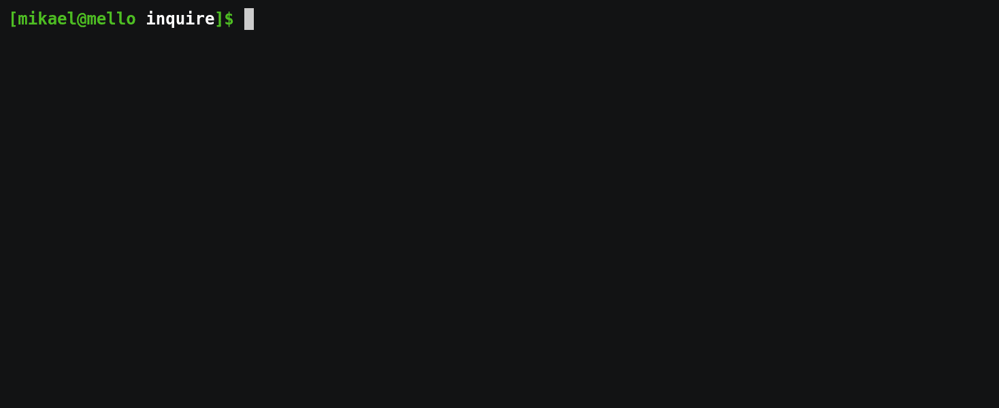

[![Latest Version]][crates.io] ![Build status] ![Supported platforms] ![License]

[crates.io]: https://crates.io/crates/inquire
[latest version]: https://img.shields.io/crates/v/inquire.svg
[build status]: https://github.com/mikaelmello/inquire/actions/workflows/build.yml/badge.svg
[supported platforms]: https://img.shields.io/badge/platform-linux%20%7C%20macos%20%7C%20windows-success
[license]: https://img.shields.io/crates/l/inquire.svg

---

<p align="center">
  
  <br>
  <code>inquire</code> is a library for building interactive prompts on terminals.
</p>

It provides several different prompts in order to interactively ask the user for information via the CLI. With `inquire`, you can use:

- [`Text`] to get text input from the user, with _built-in autocompletion support_;
- [`Editor`]\* to get longer text inputs by opening a text editor for the user;
- [`DateSelect`]\* to get a date input from the user, selected via an _interactive calendar_;
- [`Select`] to ask the user to select one option from a given list;
- [`MultiSelect`] to ask the user to select an arbitrary number of options from a given list;
- [`Confirm`] for simple yes/no confirmation prompts;
- [`CustomType`] for text prompts that you would like to parse to a custom type, such as numbers or UUIDs;
- [`Password`] for secretive text prompts.

---

## Demo


[Source](./examples/expense_tracker.rs)

## Features

- Cross-platform, supporting UNIX and Windows terminals (thanks to [crossterm](https://crates.io/crates/crossterm));
- Several kinds of prompts to suit your needs;
- Support for fine-grained configuration for each prompt type, allowing you to customize:
  - Default values;
  - Input validators and formatters;
  - Help messages;
  - Autocompletion for [`Text`] prompts;
  - Custom list filters for Select and [`MultiSelect`] prompts;
  - Custom parsers for [`Confirm`] and [`CustomType`] prompts;
  - Custom extensions for files created by [`Editor`] prompts;
  - and many others!

## Usage

Put this line in your `Cargo.toml`, under `[dependencies]`.

```
inquire = "0.7.5"
```

\* This prompt type is gated under a feature flag, e.g.:

```
inquire = { version = "0.7.5", features = ["date", "editor"] }
```

[`text`]: https://docs.rs/inquire/*/inquire/prompts/text/struct.Text.html
[`dateselect`]: https://docs.rs/inquire/*/inquire/prompts/dateselect/struct.DateSelect.html
[`select`]: https://docs.rs/inquire/*/inquire/prompts/select/struct.Select.html
[`multiselect`]: https://docs.rs/inquire/*/inquire/prompts/multiselect/struct.MultiSelect.html
[`confirm`]: https://docs.rs/inquire/*/inquire/prompts/confirm/struct.Confirm.html
[`editor`]: https://docs.rs/inquire/*/inquire/prompts/editor/struct.Editor.html
[`customtype`]: https://docs.rs/inquire/*/inquire/struct.CustomType.html
[`password`]: https://docs.rs/inquire/*/inquire/prompts/password/struct.Password.html
